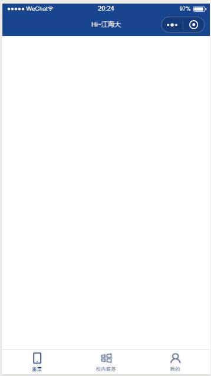
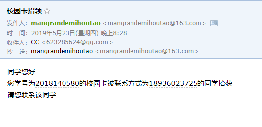
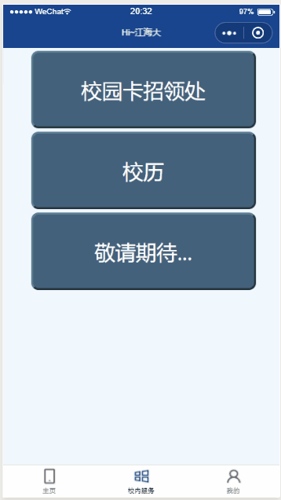
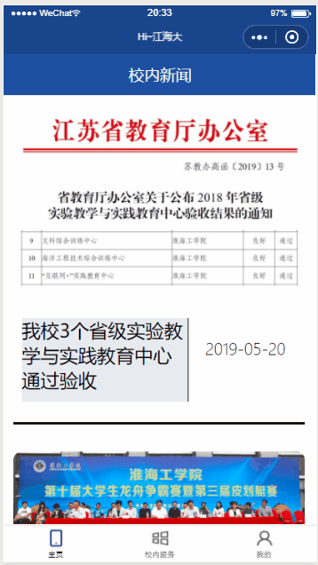

# HI_JHD 小程序说明与演示
## 为什么写这个小程序
四月中旬的时候收到学校通知有这么一个小程序设计竞赛，小程序是我从来没有接触过的东西，而且小程序的技术找中使用的前端技术我也没有系统的学过。所以就打算借着这个机会学习一下包括小程序开发、HTML、CSS、JS的相关内容。  
适逢我校在冲刺江苏海洋大学的改名事项，所以就想借着这个机会开发一款可以方便同窗使用的校内服务性小程序。
## 小程序可以干什么
由于本人技术上不够成熟，时间有限，且还有学习任务在身。所以没有按照预想中完成全部的功能。如有机会，后续会完成本项目的开发。  
通过使用基于python的爬虫技术，可以在小程序内查看学校的旭日新闻网主页上的“学校要闻”栏目。可以查询自己的考试信息。  
同时，小程序还提供一些方便同学的服务。例如校园卡招领和校历查询等。值得一提的是，校园卡招领功能中当有人拾获了校园卡并录入正确的信息后，如果校园卡的主人也使用过小程序且在小程序中登记了自己的信息，则后台将会自动发送一封邮件给该卡的主人。
## 小程序使用的技术栈
### 小程序必须使用的前端技术
+ JavaScript
+ HTML 
+ CSS
### 后端技术
+ python
+ flask
+ mysql
+ docker
## 项目演示
1. 首次使用小程序，进入主页后跳转至信息采集页。   
   

---
2. 小程序主页：新闻页  
   

---
3. 校园卡招领  
   
  
校园卡信息登记后失主会收到邮件  

---
4. 查看校历  
   

---
5. 查询考试成绩  

## 更多
### 项目前端地址
- [https://github.com/cooktea/HI_JHD](https://github.com/cooktea/HI_JHD)
### 项目后端地址
- [https://github.com/cooktea/HI_JHD_SERVER](https://github.com/cooktea/HI_JHD_SERVER)